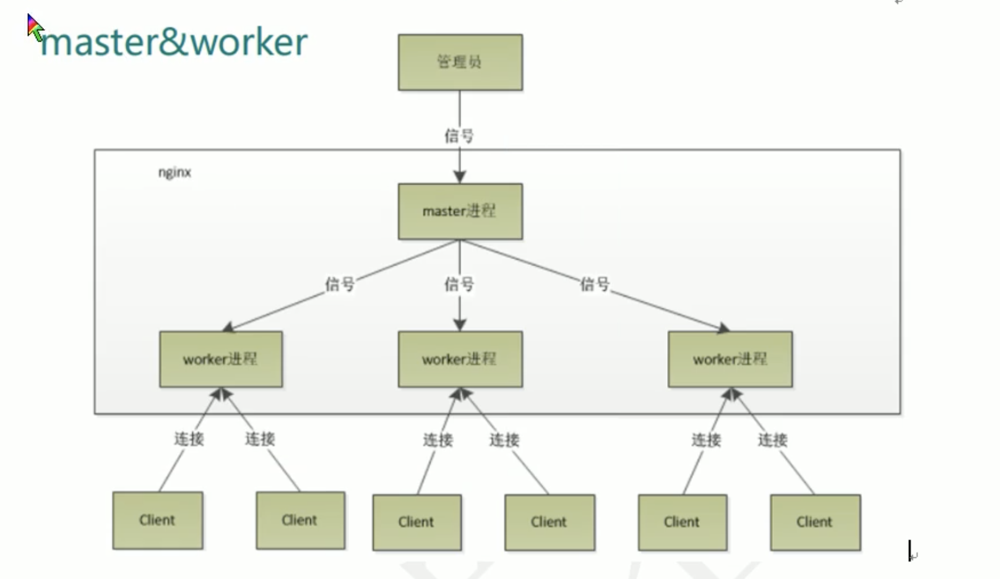
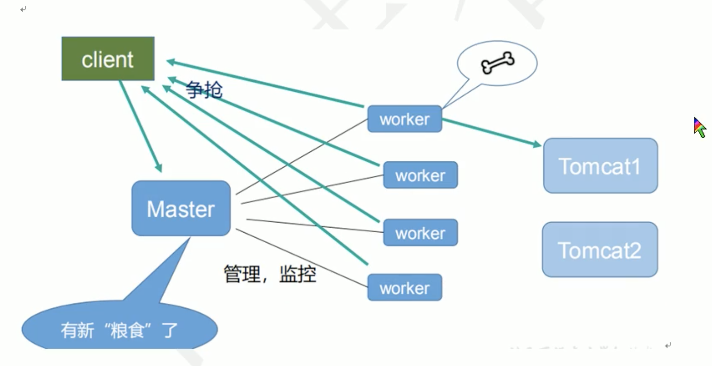

# Nginx与服务器集群

##  集群

### 什么是集群

- 集：合在一起，放在一起
- 群：一堆，很多

### 服务器架构集群

多台服务器组成的的响应 **大并发**、**高流量** 的架构体系，又被描述为 **分布式服务器架构**

**特点**

- 成本高
- 降低单台服务器的压力，使流量平均分配到多台服务器
- 使网站服务架构更加安全稳定

### web服务器软件

提供  `http`  和  `htpps`  协议的服务软件，比如：网站，网页访问等功能

- LAMP
  - Linux：操作系统
  - Apache：网页服务器
    - 老牌服务器软件，功能多，支持多种配置
  - MySQL或MariaDB：数据库管理系统
  - PHP、Perl或Python：脚本语言
- LNMP
  - Linux：操作系统
  - Nginx：高性能的  `HTTP`  和 反向代理服务器
    - 安装小巧、并发量高
    - web服务器
    - 代理服务器
    - 邮箱服务器
    - 俄罗斯
  - MySQL或MariaDB：数据库管理系统
  - PHP、Perl或Python：脚本语言
- IIS：微软公司
- lighttpd：德国
- tengine：nginx  国内淘宝定制版

### 数据库

#### 关系型数据库（RDBMS）

- MySQL
- Oracle
- MariaDB
- SQL Server
- DB2：IBM公司

#### 非关系型数据库

- Redis
- MongoDB

### 负载均衡

负载均衡服务器，分发请求到不同的服务器，使流量平均分配。

- 硬件级别：F5  性能好，价格高
- 软件级别：性价比高

### 分发软件

LVS：Linux

Nginx：upstream  功能分发

### 资源服务器

存储静态资源，一般此服务器，硬盘能力强，读写快速，带宽更大。

### 反向代理

反响代理服务器具有代理请求到对应服务器的功能，也具有缓存的功能。


- nginx
- squid
- varnish

### 高可用

高可用服务器，是用来监控负载均衡的服务器，一旦发现负载均衡宕机，会接替负载均衡服务器的工作，继续进行网络分发工作。可以认为是负载均衡的备份服务器

- heartbit
- keeplive

### 缓存软件

- memcached
- redis

### cdn内容分发

cdn：内容分发网络

## Nginx服务器

占用内存少，并发能力强

### 特点

- 热部署：nignx  在修改配置文件后，不需要重启，支持重载
- 可以高并发连接：相同配置的服务器，nginx  比  apache  能接受的连接多很多
- 低内存消耗：相同的服务器，nginx  比  apache  低消耗
- 处理响应请求很快：nginx  处理静态文件的时候，响应速度很快
- 具有很高的可靠性

### Apache与Nginx的区别

## Nginx

### 常用命令

- 查看版本： `nginx -v`
- 启动：`nginx`
- 查看运行状态：`ps -ef | grep nginx`
- 停止：`nginx -s stop`
- 重加载：`nginx -s reload`   当配置文件修改后，不用关闭nginx，使用改命令重新加载

### 配置文件

```nginx
#user  nobody;
worker_processes  1; # 并发量配置

#error_log  logs/error.log;
#error_log  logs/error.log  notice;
#error_log  logs/error.log  info;

#pid        logs/nginx.pid;


events {
    worker_connections  1024; # 支持的最大链接数
}


http {
    include       mime.types;
    default_type  application/octet-stream;

    #log_format  main  '$remote_addr - $remote_user [$time_local] "$request" '
    #                  '$status $body_bytes_sent "$http_referer" '
    #                  '"$http_user_agent" "$http_x_forwarded_for"';

    #access_log  logs/access.log  main;

    sendfile        on;
    #tcp_nopush     on;

    #keepalive_timeout  0;
    keepalive_timeout  65;

    #gzip  on;

    server {
        listen       8080;
        server_name  localhost; # 反响代理  localhost改为192.168.1.167

        #charset koi8-r;

        #access_log  logs/host.access.log  main;

        location / {
            root   html;
      			proxy_pass http://127.0.0.1; # 转发至另一个地址
            index  index.html index.htm;
        }

        #error_page  404              /404.html;

        # redirect server error pages to the static page /50x.html
        #
        error_page   500 502 503 504  /50x.html;
        location = /50x.html {
            root   html;
        }

        # proxy the PHP scripts to Apache listening on 127.0.0.1:80
        #
        #location ~ \.php$ {
        #    proxy_pass   http://127.0.0.1;
        #}

        # pass the PHP scripts to FastCGI server listening on 127.0.0.1:9000
        #
        #location ~ \.php$ {
        #    root           html;
        #    fastcgi_pass   127.0.0.1:9000;
        #    fastcgi_index  index.php;
        #    fastcgi_param  SCRIPT_FILENAME  /scripts$fastcgi_script_name;
        #    include        fastcgi_params;
        #}

        # deny access to .htaccess files, if Apache's document root
        # concurs with nginx's one
        #
        #location ~ /\.ht {
        #    deny  all;
        #}
    }


    # another virtual host using mix of IP-, name-, and port-based configuration
    #
    #server {
    #    listen       8000;
    #    listen       somename:8080;
    #    server_name  somename  alias  another.alias;

    #    location / {
    #        root   html;
    #        index  index.html index.htm;
    #    }
    #}
  
    # 反向代理
    server {
        listen       9001;
        server_name  192.168.1.167;

        location ～ /a/ {
      			proxy_pass http://127.0.0.1:8081;
        }
     		location ～ /b/ {
      			proxy_pass http://127.0.0.1:8082;
        }
    }
  
    # 负载均衡
    upstream myServer {
			server 192.168.1.167:8080;
      server 192.168.1.167:8081;
    }
    server {
        listen       80;
        server_name  192.168.1.167;
        location / {
      			proxy_pass http://myServer;
        }
    }
   # 动静分离
  server {
        listen       80;
        server_name  192.168.1.167;
        location /www/ {
      			root /data/;
      			index index.html index.htm;
        }
        location /image/ {
          root /data/;
          autoindex on; # 列出文件目录
        }
    }


    # HTTPS server
    #
    #server {
    #    listen       443 ssl;
    #    server_name  localhost;

    #    ssl_certificate      cert.pem;
    #    ssl_certificate_key  cert.key;

    #    ssl_session_cache    shared:SSL:1m;
    #    ssl_session_timeout  5m;

    #    ssl_ciphers  HIGH:!aNULL:!MD5;
    #    ssl_prefer_server_ciphers  on;

    #    location / {
    #        root   html;
    #        index  index.html index.htm;
    #    }
    #}
    include servers/*;
}
```

### 配置中的正则表达式

- ～：用于表示url中包含正则表达式，区分大小写
- ～*：用于表示url中包含正则表达式，不区分大小写
- =：严格匹配，url中不包含正则表达式，请求字符串与url严格匹配，如果匹配成功，就停止向下搜索并立即处理该请求
- ^～：url中不含正则表达式，要求nginx服务器找到标识url和请求字符串匹配度最高的location后，立即使用此localtion处理请求，而不在使用location块中的正则url和请求字符串做匹配

### 负载均衡平均分配策略

- 轮询：默认，根据请求顺序，逐一分配到不同的服务器，如果服务宕掉，自动剔除

```nginx
# 负载均衡
upstream myServer {
  server 192.168.1.167:8080;
  server 192.168.1.167:8081;
}
server {
  listen       80;
  server_name  192.168.1.167;
  location / {
    proxy_pass: http://myServer;
  }
}
```

- 权重
  - weight：默认值为1，权重越高被分配的客户就越多

```nginx
# 负载均衡
upstream myServer {
  server 192.168.1.167:8080 weight=5;
  server 192.168.1.167:8081 weight=10;
}
server {
  listen       80;
  server_name  192.168.1.167;
  location / {
    proxy_pass: http://myServer;
  }
}
```

- ip_hash：指定用户永远只访问同一台服务器，以第一次访问为准，可以解决session共享问题

```nginx
# 负载均衡
upstream myServer {
  ip_hash;
  server 192.168.1.167:8080;
  server 192.168.1.167:8081;
}
server {
  listen       80;
  server_name  192.168.1.167;
  location / {
    proxy_pass: http://myServer;
  }
}
```

- fair方式：根据后端服务器的响应时间分配

```nginx
# 负载均衡
upstream myServer {
  server 192.168.1.167:8080;
  server 192.168.1.167:8081;
  fair;
}
server {
  listen       80;
  server_name  192.168.1.167;
  location / {
    proxy_pass: http://myServer;
  }
}
```

### 动静分离

```nginx
server {
  listen       80;
  server_name  192.168.1.167;
  location /www/ {
    root /data/;
    index index.html index.htm;
  }
  location /image/ {
    root /data/;
    expires 3d; # 设置缓存
    autoindex on; # 列出文件目录
  }
}
```

### 高可用服务器

前提

- 两台nginx服务器
- keepalived软件
- 虚拟ip

## Nginx原理






### 一个master多个worker的好处

- 可以使用热部署
- 独立的进程，不需要加锁，服务不会中断，降低风险

- 设置多少个worker？
  - worker与cpu数相等最合适

- worker连接数？
  - 发送一次请求，占用了几个worker数？2个或者4个

- 一个master，有四个worker，每个worker最大连接数1024，最大并发数？
  - 作为反向代理：4 * 1024 / 2（除以2或者4）