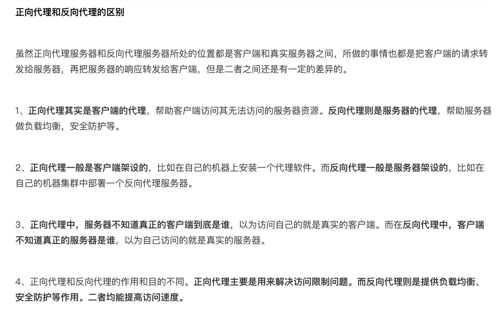

# Nginx与服务器集群

##  集群

### 什么是集群

- 集：合在一起，放在一起
- 群：一堆，很多

### 服务器架构集群

多台服务器组成的的响应 **大并发**、**高流量** 的架构体系，又被描述为 **分布式服务器架构**

**特点**

- 成本高
- 降低单台服务器的压力，使流量平均分配到多台服务器
- 使网站服务架构更加安全稳定

### web服务器软件

提供  `http`  和  `htpps`  协议的服务软件，比如：网站，网页访问等功能

- LAMP
  - Linux：操作系统
  - Apache：网页服务器
    - 老牌服务器软件，功能多，支持多种配置
  - MySQL或MariaDB：数据库管理系统
  - PHP、Perl或Python：脚本语言
- LNMP
  - Linux：操作系统
  - Nginx：高性能的  `HTTP`  和 反向代理服务器
    - 安装小巧、并发量高
    - web服务器
    - 代理服务器
    - 邮箱服务器
    - 俄罗斯
  - MySQL或MariaDB：数据库管理系统
  - PHP、Perl或Python：脚本语言
- IIS：微软公司
- lighttpd：德国
- tengine：nginx  国内淘宝定制版

### 数据库

#### 关系型数据库（RDBMS）

- MySQL
- Oracle
- MariaDB
- SQL Server
- DB2：IBM公司

#### 非关系型数据库

- Redis
- MongoDB

### 负载均衡

负载均衡服务器，分发请求到不同的服务器，使流量平均分配。

- 硬件级别：F5  性能好，价格高
- 软件级别：性价比高

### 分发软件

LVS：Linux

Nginx：upstream  功能分发

### 资源服务器

存储静态资源，一般此服务器，硬盘能力强，读写快速，带宽更大。

### 反向代理

反响代理服务器具有代理请求到对应服务器的功能，也具有缓存的功能。

🌰：a  需要访问  c，但是  a  不能直接访问  c，b  可以访问  c，a  告诉  b，访问  c，把  c  的数据返回给  a。

- 正向代理：内网访问外网

- 反向代理：外网访问内网

- nginx
- squid
- varnish

### 高可用

高可用服务器，是用来监控负载均衡的服务器，一旦发现负载均衡宕机，会接替负载均衡服务器的工作，继续进行网络分发工作。可以认为是负载均衡的备份服务器

- heartbit
- keeplive

### 缓存软件

- memcached
- redis

### cdn内容分发

cdn：内容分发网络

## Nginx服务器

占用内存少，并发能力强

### 特点

- 热部署：nignx  在修改配置文件后，不需要重启，支持重载
- 可以高并发连接：相同配置的服务器，nginx  比  apache  能接受的连接多很多
- 低内存消耗：相同的服务器，nginx  比  apache  低消耗
- 处理响应请求很快：nginx  处理静态文件的时候，响应速度很快
- 具有很高的可靠性

### Apache与Nginx的区别

## LNMP的安装与配置

