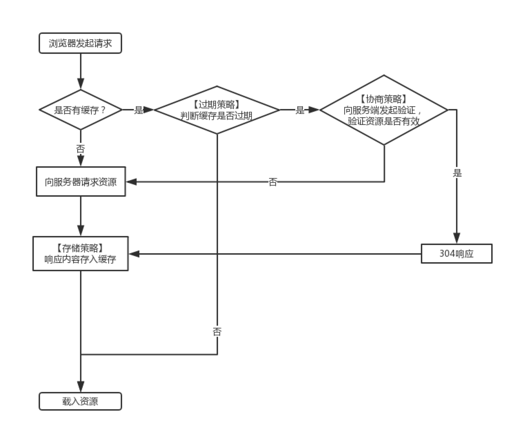

# 浏览器

## 浏览器性能优化

- 使用浏览器的缓存策略
- 减少http请求次数
  - 减少静态资源
  - 使用webpack
- 开启gzip压缩
- 使用懒加载

## 浏览器的缓存机制

### 强缓存

http状态码为：200

什么时候用memory？什么时候用disk？是根据服务器返回的文件类型判断的。

- 强缓存的两个状态
  - memory cache（内存缓存）：第一次打开浏览器，会发起请求，数据存储在浏览器的内存中。再次刷新时会从浏览器内存中取值，不会再次发起请求
  - disk cache（磁盘缓存）：从硬盘上直接读取缓存结果，不会随着浏览器的关闭而消失

### 协商缓存

http状态码为：304

- Last-Modified资源最后的更新时间，随着服务器的response返回
- If-Modified-Since通过比较两个时间来判断资源在两次请求期间是否有过修改，如果没有就命中协商请求
- ETag资源内容的唯一标识，随着服务器的response返回
- If-None-Match服务器通过请求头部的If-None-Match与当前资源的ETag是否一致来表示资源在两次请求中是否有过修改，如果没有修改，则命中协商缓存。

### 缓存配置

两种方式，设置请求头  `Cache-Control`  和  `Expires`

- Cache-Control
  - public：表示响应可以被客户端和代理服务器缓存
  - private：表示响应只可以被客户端缓存
  - max-age = 30：缓存30秒过期，需要重新请求
  - s-maxage=30：覆盖max-age，作用一样，只在代理服务器中生效
  - no-store：不缓存任何响应
  - no-cache：资源被缓存，但是立即失效，下起发起请求验证资源是否过期
    - `no-cache`并不是指不缓存文件，`no-store`才是指不缓存文件。`no-cache`仅仅是表明跳过强缓存，强制进入协商策略。
  - max-stale=30：30秒内，即使缓存过期，也使用该缓存
  - min-fresh=30：希望30秒内获取最新的响应
- Expirse
  - 缓存过期时间，用来指定资源到期的时间，是服务器端的具体时间点。也就是说expirse=max-age + 请求时间，需要和Last-modified结合使用
  - Expirse是web服务器响应消息头字段，在响应http请求时告诉浏览器在过期时间前，浏览器可以直接从浏览器缓存读取数据，而无需再次请求
  - 简述：前端设置的时间和服务器返回的时间做对比，如果在服务器的时间范围内，就使用缓存，否则使用请求过来的资源

## url回车后发生了什么

- 浏览器缓存查找
- 域名解析
- 建立连接，三次握手（不会携带任何数据）
- 发送http请求
- 拿到数据渲染页面
  - DOM树
  - CSSOM树
  - 渲染树
    - 优化：display：none不会在渲染树上
  - 回流（重排）：计算布局信息，默认文档流改变，就会引发回流重排
    - CSS3的translate、浮动、定位可以避免回流
  - 重绘：渲染引擎（把几何信息发送给GPU，利用电子枪）
  - 页面
- 断开连接，四次挥手
- 结束

## CSS加载会发生阻塞吗

- 不会阻塞DOM解析：DOM和CSS树并行构建，这个过程中不会阻塞DOM的解析
- 会阻塞DOM渲染：会阻塞DOM的渲染，因为只有两者结合好了，才会进行重排和重绘过程
- 会阻塞JS：CSS会阻塞JS的执行，因为浏览器先解析CSS，后解析JS，只有CSS解析完成后，才会解析JS

