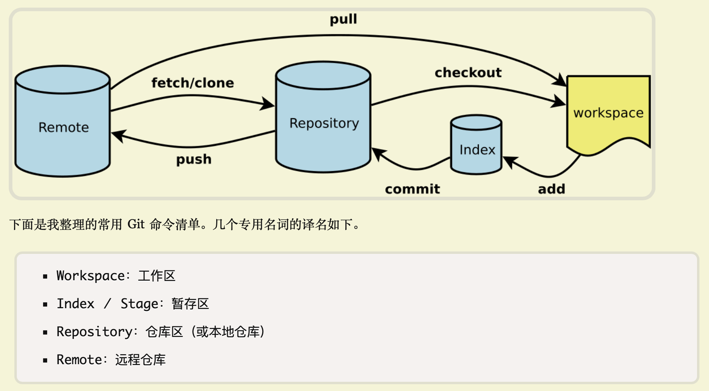
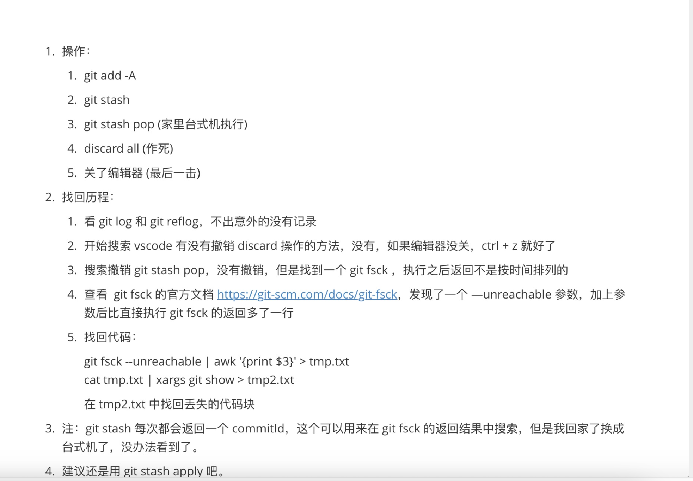

#  版本控制



## 版本控制

### 什么是版本控制

版本控制，即版本管理。版本管理就是管理更新的历史记录

它可以给我们提供一些在软件开发过程中必不可少的功能，例如：

- 记录一款软件添加或更改源代码的过程
- 回滚到特定阶段，恢复误删除的文件
- 合并多人协作的文件
- 多人协同，文件传输

### 集中式

#### SVN

- 了解

### 分布式

#### Git

##### 基本命令

- find / -name [文件名字]

- pwd
- ls
  - ls -a查看隐藏目录
- cat  查看文件内容
- less  查看大文件内容    以分页的方式    q 退出   ，空格  向下翻一整页，b向上翻一整页
- vi   visual  interface    编辑文件内容，**：q**退出，**i**也就是insert进入编辑模式，**：w**表示保存    esc   **：wq**保存并退出
- mkdir
  - mkdir  jd  &&  cd jd      创建jd目录并且进入jd目录
- touch    创建文件
- cd
- clear
- rmdir
  - 只能删除空目录
- rm
  - 删除文件
- rm -rf    目录名
  - 删除目录  可以删除非空目录   注：很强大，可以删除一些比较顽固的文件或者目录
- git log    查看日志
- gitk   打开图形界面
- git clone                   --depth=1
- git remote
- git remote show origin

##### 本地初始化仓库

- git  init
  - 出现master便是成功创建仓库
- git  status
  - 查看当前工作区、暂存区、本地仓库的状态
- git add 文件名
  - 表示把文件从   工作区   提交到   暂存区
  - git  add  index.html    a.txt    可以直接写多个文件一次提交到暂存区
  - git --all   添加所有变动的目录到暂存区
  - `git .`基本等同于`git --all`把所有的变动文件添加到暂存区
- git  commit  -m  "第一次提交" 
  - m表示message，用于对本次提交的描述
    - 注意：第一次不会提交上去   因为我们必须告诉，git我们是谁，配置了下边两条命令，就可以进行提交了
    - `git config --global user.email "the-one-allsunday@qq.com"`
    - `git config --global user.name "db"`
- git cherry-pick [另一个分支上记录的提交ID]，在使用它时，先   `git pull`  把项目拉下来
- git log 可以查看所有的提交记录
- git pull有冲突时，先git stash 把自己的代码提交到暂存区，然后git pull，再然后 git stash pop把暂存区的代码弹出来，解决冲突后，提交代码

**总结**

操作  git  的基本工作流程就是先修改文件， 然后执行  git  add  命令。

`git add`会把文件加入到暂存区    就可以执行  `git commit`命令将文件存入仓库，从而形成一次记录

##### 工作区、暂存区、本地仓库

##### 分支

默认在git的仓库中，会有一个分支远点master

- `git branch`                                           列出本地所有分支
- `git branch 分支名字dev-a`                 基于当前分支创建一个分支`debv- a`，但是依然停留在当前分支
- `git checkout dev-a`                           切换到指定分支，并更新工作区
  - `git checkout -`                            切换到上一个分支，交替和上一分支进行切换
  - `git checkout -b dev-a`              基于当前分支新建一个分支，并且切换到新建分支中

- `git merge dev-a`                                  合并指定分支到当前分支
- `git branch -d  dev-a`                          删除分支，不能自己删除自己


**常见版本控制流程**

- **Git  Flow工作流 **     分支命名：feature-login          release-1.0.0             fixbug-login
- **GitHub工作流**
  - 自己fork别人的仓库，到自己的仓库里
  - 在clone下来的项目拉出一个新分支，例如这个分支用来修改某个功能
  - 在修改完成之后，push到自己的仓库里，然后找到new  pull   request    向对方发起提交请求
  - 对方就会收到这个请求。这样几个人就可以实现社交沟通协作开发
  - 对方的可以进行代码审查
  - 代码无误后，对方选择 merge request
  - 到此，一个完整的github工作流程到此结束
- **Gitlab工作流**
  - 第三方的代码仓库托管服务有很多，其中GitHub最火，但是如果想要托管私有项目收费比较高，而且受限于国内网络环境的影响，鲜少有公司使用
  - 大公司，阿里，京东，基本也不用第三方的托管服务
  - Gitlab是一个类似于GitHub的一个系统软件，可以开源免费部署到自己的公司
  - 使用基本等同于GitHub

##### GitHub Pages静态页面托管服务

只适用于静态网页，可以在GitHub上在线预览

- 仓库的命名必须是以   `.github.io`  结尾    最前边是自己的用户名   例如`The-One-ALLsunday.github.io`

GitHub Page结合`Hexo`搭建个人静态博客：

- 先在GitHub上创建一个空的仓库

- npm  install  -g  hexo-cli
- hexo  init  blog        blog是名字可以随意取
- cd  blog
- 启动本地预览服务，默认是127.0.0.1:4000     hexo  server
- 新建文章       hexo  new   文章标题
- 自动发布 hexo 搭建的静态博客    注意下边github的仓库地址（url  user/name）


- 在blog目录里    npm  install  hexo-deployer-git  --save
- hexo deploy
- 完成部署后  生成器   hexo generate --deploy

#### git提交规范

良好的 Git commit 规范优势加快 Code Review 的流程，根据 Git Commit 的元数据生成 Changelog后续维护者可以知道 Feature 被修改的原因提交格式要求：`git commit -m "type: xxxx"`，type类型如下：

- feat：新增feature
- fix：修复bug
- docs：仅仅修改了文档，如README，CHANGELOG，CONTRIBUTE等等
- style：仅仅修改了空格，格式缩进，不改变代码逻辑
- refactor：代码重构，没有新增功能或者修复bug
- perf：优化相关，如性能提升，体验
- test：测试用例，包括单元测试和集成测试
- chroe：改变构建流程，增加依赖库，工具等
- revert：回滚到上一个版本

## GitHub搜索技巧

**并集使用可以相对精确搜索**

- 根据  name
  - `in:name vue`

- 根据  stars
  - `stars:>1000`
- 根据  forks
  - `forks: 500`
- 根据  readme
  - `in:readme vue`
- 根据  description
  - `in:description vue`
- 根据  语言(language)
  - `language: javascript`
- 根据  pushed
  - `pushed:> 2019-11-29`

## git常用操作

### 创建分支命令

```javascript
// 列出本地所有分支
git branch

// 列出所有远程分支
git branch -r

// 列出所有本地分支和远程分支
git branch -a

// 新建一个分支，并停留当前分支
git branch [branch-name]

// 新建一个分支，并切换到该分支
git checkout -b [branch-name]

// 新建一个分支，与指定的运程分支建立追踪关系
git branch --track [branch-name] [remote/branch-name]

// 切换指定分支
git checkout [branch-name]

// 切换到上一个分支
git checkout -
  
// 合并指定分支到当前分支
git merge [branch-name]

// 删除本地分支
git branch -d [branch-name]

// 删除远程分支
git push origin --delete [branch-name]

// ** 本地基于远程分支创建并切换到该分支
git checkout -b [branch-name] origin/[branch-name]
```


### 拉取代码命令

```javascript
// 将远端master分支代码拉到本地temp分支
git fetch -f origin master:temp

// 拉取远程仓库的所有变动
git fetch

//
git pull === git fetch + git merge

// 
git pull --rebase
```

### 查看命令

```javascript
// 显示有变更的文件
git status

// 显示当前分支版本历史
git log

// 显示提交记录，及每次变更的文件
git log --stat

// 搜索提交历史，根据关键词
git log -S [keyword]

// 显示指定文件是什么人在什么时间修改过
git blame [file]

// 显示暂存区和工作区的差异
git diff

// 显示某次提交发生变化的文件
git show --name-only [commit]

// 显示某次提交时，某个文件的内容
git show [commit]:[filename]

// 显示当前分支的最近几次提交
git reflog
```

### 提交命令

```javascript
// cherry-pick 把某次提交记录选到当前分支
git cherry-pick id

// 
```

### 推送代码

```javascript
// 上传本地分支到远程仓库
git push [remote] [branch]

// 将temp最新内容push到远端master分支
git push origin temp:master

// 强行推送当前分支到远程仓库，即使有冲突
$ git push [remote] --force

// 推送所有分支到远程仓库
$ git push [remote] --all
```

### 撤回命令

参考博客: [参考博客](https://blog.csdn.net/yxlshk/article/details/79944535)

```javascript
// 返回到某个节点，不保留修改
git reset --hard HASH

// 返回到某个节点，保留修改
git reset --soft HASH

// 撤回之后需要
git push -f


// 不想commit了，希望撤回到add之前的操作，但要保留修改（包括新加文件，删除文件，已有文件）
git reset -q
git reset --mixed 是 git add 的反向操作
git clean -df // 返回到某个节点
git clean [参数] // -n 显示将要删除的文件和目录 -f 删除文件 -df 删除文件和目录

// 回滚命令，并保留回滚处理
git revert [id]
```


### git fsck 代码找回




