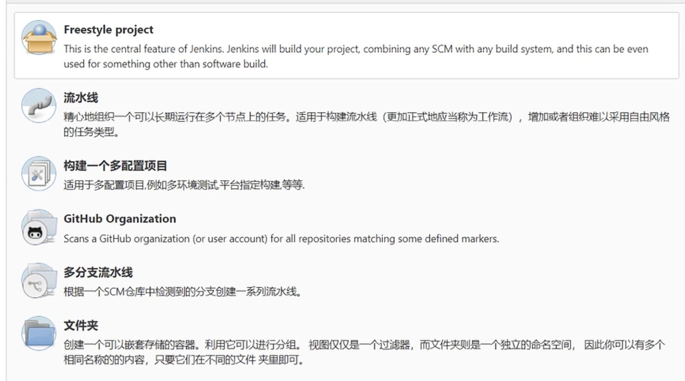

# Jenkins

## 安装

地址：[官网](https://www.jenkins.io/download/lts/macos/)

### mac 安装

- 安装：brew install jenkins-lts，指定版本：brew install jenkins-lts@YOUR_VERSION
- 启动：brew services start jenkins-lts
- 重启：brew services restart jenkins-lts
- 更新：brew upgrade jenkins-lts

## 配置

### 解锁Jenkins

- 访问8080端口，稍后修改为9000端口

- 待初始化完成后，根据指定地址 `/Users/dengbo/.jenkins/secrets/initialAdminPassword` 找到密码，copy至管理员密码输入框

### 自定义Jenkins

- 选择插件安装，选择**无**

### 创建第一个管理员用户

- 账户：admin
- 密码：password
- fullname：admin
- Jenkins url：http://localhost:9000/

### 修改默认端口号

	- cd /usr/local/opt/jenkins-lts
	- vim homebrew.mxcl.jenkins-lts.plist，把端口号修改为想要的即可，本人使用9000端口

### 更换插件下载源地址

参考：[知乎文章](https://zhuanlan.zhihu.com/p/133406941)

- 打开Jenkins管理页面，Manage Jenkins -> Manage Plugins -> advanced
- 页面滑至最下方，修改Update Site URL为`https://mirrors.tuna.tsinghua.edu.cn/jenkins/updates/update-center.json`
- 打开Jenkins安装地址，进入`/Users/dengbo/.jenkins/updates`目录，修改default.json文件：
  - `updates.jenkins.io/download` 修改为 `mirrors.tuna.tsinghua.edu.cn/jenkins`
  - `www.google.com` 修改为 `www.baidu.com`
- 重启Jenkins服务

## 概念

### Job

在Jenkins平台中，都是以Job（任务/工程）为单位去完成一件事的

### Plugin

Jenkins提供平台，集成各种插件来完成一个Job

### workspace

Jenkins是通过文件形式来存储和管理数据

## 管理

主要有三个板块，其中都与plugin有关，当下载了一些plugin，会在这三大板块中出现配置，然后自己配置就好了

### Configure System

- of executors：2，同时可以执行两个任务

### Global Tool Configuration

### Plugin Manager

### 。。。还有很多，权限等

## 创建普通 Job

New Item，点击左侧导航栏第一项，创建任务

任务类型：以下为几个常用的任务类型，默认只有Freestyle project，其余均为插件扩展



Job 配置面板，**每个Job都有6项通用配置**

### General

基本信息

- description：对job做一些简单的说明，例如
  - 谁创建的？
  - 什么时候创建的？
  - 什么项目？
  - 目的？
  - 多久运行一次？等
- ***Discard（丢弃） old builds**：* 丢弃掉旧的构建，随着项目构建次数增多，构建后的文件会越来越多，导致占用磁盘越来越多。两个策略，任选其一即可
  - Days to keep builds：已天为单位，保留多少天的构建。60 就是60天
  - Max # of builds to keep：已构建次数为标准，保留多少次的构建。60就是60次

### Source Code Management

源码管理：通常使用Git（根据公司匹配吧，也可以是SVN等），Jenkins需安装Git插件（本地要有Git环境，安装Git客户端）

- Repository URL：源码所在地址
- Credentials（凭证）：点击add，添加账号；添加完成之后，可以选择用户（选择完，会有检测的过程，检测该账号是否可用）
  - kind：可选用户名和密码（根据需要进行选择）
  - userName：仓库账号
  - password：仓库密码

到此，后边什么都不配置的话，执行**立即构建**，Jenkins会根据会去下载源码

- build history可以查看构建历史，点击每一条构建历史，可查看改记录的详情 
- Console Output：进入详情面板，Console Output，可以看到进展及输出信息

### Build Triggers

构建触发器：触发任务执行（有很多种，定时构建为例），什么时候执行，多久执行。

- Build periodically（定时构建）：
  - Schedule：点击❓会介绍怎么使用。
    - 语法格式：***分钟 + 小时 + 一月的天数 + 月份 + 一周的天数***（0-7，0和7都表示周天），每一小项都是有有效值的
    -  0 20 * * *         每天晚上20点执行
    - 0 20 * * 1,3,5    每周一，周三，周五晚上20点执行
    - 0 20 * * 15        每周周一-周五晚上20点执行
    - 0 20 * * */2       一周内每两天（\*/ 2），晚上20点执行

### Build Environment

构建环境

### Build

构建

- Add Build Step：根据本地环境选择怎样去执行command，shell执行等
- Command：
  - node main.js 等

### Post-build Actions

构建完成之后，可以做的（生成报告、钉钉/邮箱通知）等 

#### 生成报告 

- 安装插件：HTML Publisher

- 打开Job配置：在Post-build Actions中进行配置

  -  Add post-build action：选择**Publish HTML reports**插件

  - Reports：该插件下的add

    - HTML directory to archive：HTML 文件路径，相对路径(相对于工作空间该任务)

      > outputs/reports

    - Index page[s]：报告文件名

      > 因为生成的报告名称是变动的（时间），所以此处应 匹配所有的html文件，最好是只有一个最新的html文件
      >
      > *.html

    - Index page title[s] (Optional) 

    - Report title：报告标题 

**配置完成，需要重新构建**

报告样式问题： 

**方案一：**临时，不能重启Jenkins

- Manage Jenkins -> Tools and Actions -> Script Console
- 输入命令：`System.setProperty("hudson.model.DirectoryBrowserSupport.CSP", "")`
- 执行run：不报错

**方案二：**需要本地有groovy环境，无关Jenkins状态，启动或者停止

- 安装groovy插件

- Build完成之后

  > Add build step：选择执行groovy脚本
  >
  > Groovy command：`System.setProperty("hudson.model.DirectoryBrowserSupport.CSP", "")`


#### 邮件通知

**方案一：**使用 jenkins 默认邮件模块，**使用不多**

- 打开Job配置：在Post-build Actions中进行配置

  - Add post-build action：选择**E-mail Notification**

    > Recipients（收件人）：  可以配置多个

- 缺点：

  - 构建任务失败或者不稳定时才通知
  - 无法对邮件进行定制化处理

**方案二：**使用插件Email Pulgin，**推荐**

- 安装插件：Email Pulgin

- 配置：在Manage Jenkins中，配置邮件服务器，发件人，系统管理员邮箱（发件人和系统管理员邮箱保持一致）

  - Manage Jenkins -> Configure System -> System Admin e-mail address

    - 输入：`xxx@qq.com`

  - Manage Jenkins -> Configure System -> Extended E-mail Notification

    - SMTP server

      > 例如：smtp.qq.com

    - Advanced：添加Credentials

      > userName 为qq号
      >
      > password 为qq邮箱授权码。需要自己去qq邮箱开启smtp服务，并生成授权码

    - 勾选 Use SSL

    - SMTP Port：去掉默认端口号

- 发邮件：

  -  打开Job配置：在Post-build Actions中进行配置

  - Add post-build action：选择**Editable Email Notification**

    - Project From（发件人）：`xxx@qq.com`，需要与系统管理员邮箱保持一致

    - Project Recipient List（收件人）：`xxx@qq.com,xxx@qq.com`，可以多个，逗号隔开

    - Content Type（内容类型）：多种类型可供选择，html相关可以完成自定义

    - Default Subject（主题）：例如：有关什么什么的通知

    - Default Content（邮件正文）：html类型的话，需要html的格式，不支持外联样式

      ```html
      <!-- 方式一：自己编写html -->
      <html>
        <h3>
          通知
        </h3>
        <p>
          正文正文正文正文正文正文正文正文正文正文正文正文正文正文正文正文正文正文正文
          ${TEST_COUNTS,var="TYPE"}  <!-- 变量格式 -->
          ${TEST_COUNTS,var="total"} <!-- 使用 -->
        </p>
      </html>
      
      <!-- 方式二：使用模板html文件 -->
      ${FILE,path="PATH"}            <!-- 格式 -->
      ${FILE,path="template.html"}   <!-- 使用 -->
      ```

    - Attachments（附件）：📎附件位置放在相对空间之下的

    - Attach Build Log（构建日志）：默认不作为附件发送

    - Content Token Reference（变量）：点击❓，可以查看所有可用的变量。想要邮件正文访问变量，需要生成xml格式文件，并记录信息（build 结束后，可以生成xml文件，**并且需要添加构建步骤识别该xml文件**👇（与下边小手对应）） 

    - 是

  - Add post-build action：选择**Publish JUnit test result report**，👆（与上边小手对应）

    - 选择完：添加构建步骤第一行会出现Publish JUnit test result report配置

      > 测试报告（XML）：填入xml文件地址  outputs/*.xml

- 优点：

  - 成功失败都可通知，自定义
  - 可以对邮件定制化处理

## Jenkins pipeline Job

- workflow：git下载代码 -> 编译打包 -> 部署 -> 自动测试 -> 发布
- workflow：git下载代码 -> 代码扫描 -> 执行自动化脚本 -> allure（报告）展示 -> 邮件通知


### 声明式语法

可以嵌入脚本式

### pipeline Job

- 安装插件：Pipeline  

- New Item

- 选择pipeline：选择Pipeline script from SCM

  - General

  - Build Triggers

  - Advanced Project Options

  - Pipeline：**推荐** 在SCM中直接添加Jenkinsfile文件

    ```groovy
    // 基本语法
    // 可以使用pipeline生成器 在url里最后输入/directive-generator
    
    pipeline {
        agent any // 主从模式可以使用
      
      stages { // 阶段，所有的任务步骤都在里面
        
        stage("yarn") {
          
          steps { // 具体任务步骤
            sh 'yarn'
          }
          
        }
        
        post { // 任务完成之后的处理，发邮件等
          
           always {
               // do something 
            }
          
        } 
      }
    }
    ```

  - **回放**：进入某一个构建历史记录里，有一个回放功能，在此，我们可以对pipeline脚本更改，然后运行，会再次生成一天记录


### pipeline 使用全局变量

流水线语法 -> 全局变量参考 即可查看所有语法


### pipeline 自定义变量 

- 用在最高层的pipeline块的environment指令适用于流水线的所有步骤
- 定义在stage中的environment指令只适用于stage中的步骤

```groovy
pipeline {
  environment {
    env_global_env1 = 'env_global_env1' // 定义
  }
  
  stages {
    
    stage('Example') {
      environment {
        env_stage_env1 = 'env_stage_env1'
      }
      steps {
        sh 'printenv '
      }
    }
    
    post {
      always {
        subject: "global_env1: ${env.env_global_env1}" // 使用
      }
    }
    
  }
  
} 
```


