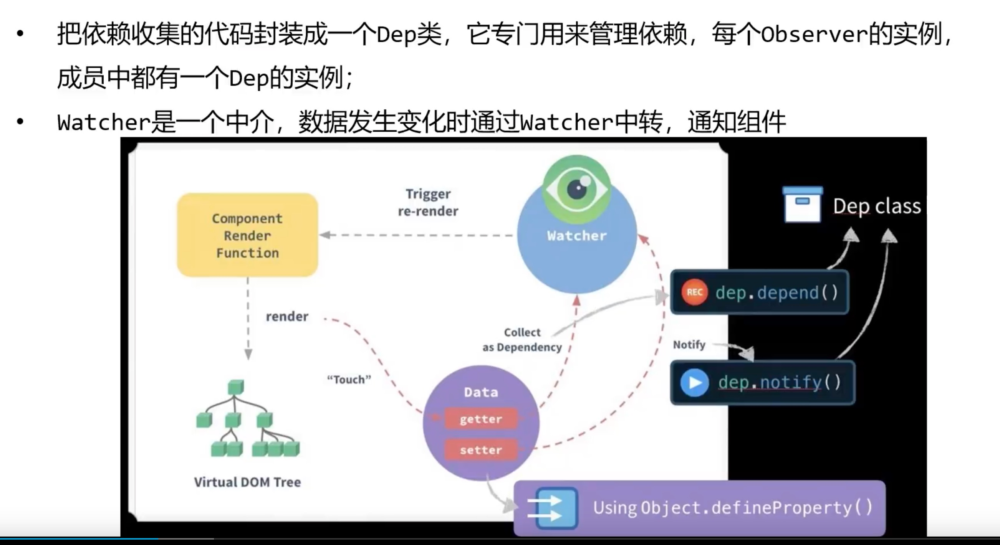
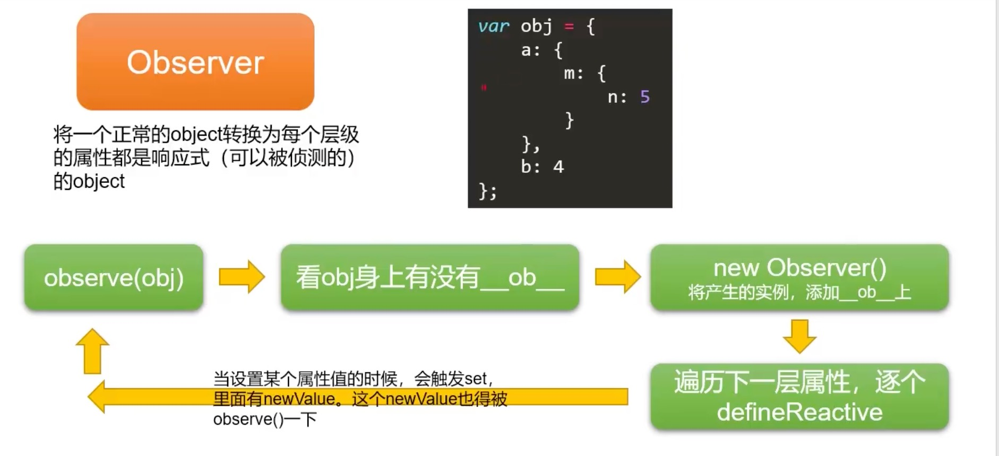
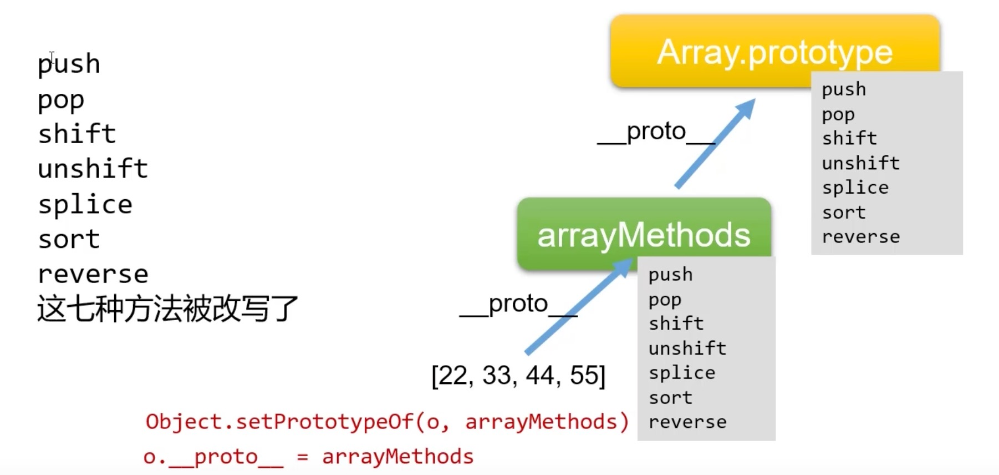

#  Vue学习

```javascript
<div id="app"></div>

var vm = new Vue({
    el: '#app',
    data: {
        msg: '我是MVVM中的  M'
    },
    methods: {
        show(){
        console.log('嗯...我被调用了，我需要v-on指令')
        }
    },
    filters: {
        dataFormat: function (data, 参数1, 参数2) {

        }
    },
    directives: {
        'fontwight': {
            bind: function (el, binding) {
                el.style.fontWeight = binding.value
            },
            inserted: function (el) {},
            updated: function (el) {}
        }
    },
    components: {
        login: {
            template: '<h1>这是登录的私有组件</h1>'
        }
    },
    router: routerobj,
    watch: {
        firstname: function (newVal, oldVal) {
            this.fullname = newVal + this.lastname
        },
        lastname: function (newVal, oldVal) {
            this.fullname = this.firstname + newVal
        }
    },
    computed: {
        fullname: function () { // 只要计算属性的function中，所依赖的任何数据发生变化了，则会触发计算属性重新求值
            return this.firstname + this.lastname
        }
    },
    render: c => c(app),
    store: store

    beforeCreate(){},
    created(){},
    beforeMount(){},
    mounted(){},
    beforeUpdate(){},
    updated(){},
    beforedestroy(){},
    destroyed(){} 
})
```

- Vue提供的标签

   + `<transition></transition>`
   + `<transition-group></transition-group>`

  + `<template></template>`
  + `<component :is=""></component>`

- vue-router中提供的标签
  	+ `<router-view></router-view>`
  	+ `<router-link to=""></router-link>`

##  基本指令

- v-clock：解决插值表达式闪烁问题

  ```javascript
  [v-cloak] {
      display: none
  }
  
  <p v-cloak>{{ msg }}</p>
  ```

- v-text：默认没有闪烁问题

  ```javascript 
  <p v-text="msg"></p>
  ```

- 插值表达式和v-text的相同点和不同点
   + 相同点： 都可以渲染数据
   + 不同点：v-text会覆盖替换元素的内容，但是差值表达式 只会替换自己这个占位符，不会把整个元素内容清空

- v-html：可以渲染html数据

  ```javascript
  <p v-html="msg"></p>
  
  data: {
      msg: '<h1>我需要v-html属性来渲染，只有他认识我</h1>'
  }
  ```

- v-bind属性指令：v-bind会把后边引号里边的字符当成js代码 **（变量）**执行，可以简写 `:`
- v-on事件绑定指令：可以简写为 `@`
   + 常见事件
     	* click
     	* mouseover
     	* keyup
     	* keydown
     	* 。。。

- 事件修饰符

   + .stop 阻止冒泡

   + .prevent 阻止默认行为 主要是阻止a链接和表单submit

   + .capture 实现触发捕获机制

   + .self 实现只有点击当前元素时，才会触发事件处理函数 会有阻止冒泡的行为，但是只是自身元素没有冒泡，不包含其他元素的冒泡行为

   + .once 只触发一次事件处理函数

     

- 按键修饰符: 相当于按下了某个键，以下是系统内置的按键修饰符
  + `@keyup.enter="add"`
    	* .enter
    	* .tab
    	* .delete
    	* .esc
    	* .space
    	* .up
    	* .down
    	* .left
    	* .right

- v-model=" " 双向数据绑定  **只能用到表单元素中**

- v-for 循环遍历**普通数组** 和 **数组对象** 和 **对象** 和 **迭代数字**

   + 在组件中使用v-for循环，一定要加上`:key=""`,保证每条数据的唯一性

   + 遍历数组对象

     ```html
     <p v-for="(item, i) in list" :key="item.id">
     	ID: {{ item.id }}------名字: {{ item.name }}------索引: {{i}}
     </p>
     ```

  +  遍历对象

    ```html
    <p v-for="(val, key, i) in user">
        值是: {{ val }}--键是: {{key}}--索引是: {{i}}
    </p>
    ```

  + 迭代数字：**注意：这里的count从数字**`1`**开始**

    ```html
    <p v-for="count in 10">这是第{{count}}次循环</p>
    ```

    

- v-if 每次是创建或删除元素
  
  - 有切换性能消耗
- v-show 每次不会创建或删除元素，通过`display`样式属性来显示隐藏元素
  
  - 有较高的初始渲染消耗

## 在Vue中使用样式

### 使用内联样式

**在为class使用 v-bind绑定对象的时候，对象属性是类名，所以对象的属性可带引号，也可以不带引号；属性值是标识符**

- 使用数组：注意要通过属性绑定  `red` 和 `thin` 和 `active`都是类

  ```html
  <h1 :class="['red','thin']">这是一个红色细字体</h1>
  ```

- 在数组中使用三元表达式

  ```html
  <h1 :class="['red', 'thin', flag ? avtive : '' ]">这是一个红色细字体</h1>
  ```

- 在数组中使用对象来代替三元表达式

  ```html
  <h1 :class="['red', 'thin', { 'active' : flag } ]">这是一个红色细字体</h1>
  ```

- 直接使用对象：`red` `thin` `active`是类名，`true`是标识符

  ```html
  <h1 :class="{ red: true, thin: true, active: true}">这是一个红色细字体</h1>
  ```

  

### 使用行间样式

- 直接操作元素，在元素身上通过`:style`的形式，书写样式对象

  ```html
  <h1 :style="{ color: 'red', 'font-weight': 200 }"></h1>
  ```

- 将样式对象定义到 data 中，并直接引用到 `:style`中

  + 在data中定义样式

    ```javascript
    data: {
        h1StyleObj : { color: 'red', 'font-weight': 200 }
    }
    ```

  + 在元素中通过属性绑定的形式，将样式对象应用到元素中

    ```javascript
    <h1 :style="h1StyleObj"></h1>
    ```

    

- 在`:style`中 通过数组，引用多个 `data`上的样式对象

   + 在data中定义样式

     ```javascript
     data: {
         h1StyleObj : { color: 'red', 'font-weight': 200 },
         h1StyleObj2 : { fontStyle: italic }
     }
     ```

  + 在元素中通过属性绑定的形式，将样式对象应用到元素中

    ```html
    <h1 :style="[h1StyleObj, h1StyleObj2]"></h1>
    ```

    

#### 总结

- MVC 和 MVVM 的区别
- 学习了 Vue 的基本代码结构
- 插值表达式 v-cloak、v-text、 v-html、v-bind、 v-on、v-model、v-if、v-show、v-for
- 事件修饰符
- el是指定的控制区域、 data是数据对象，指定了控制区域要用的数据， methods也是一个对象，这里可以自定义方法
- 在VM实例中，如果想要访问data上的数据，或者想要访问methods中的方法，都必须用 `this`
- v-for必须使用 `:key=""`属性，（只接受number和string类型）
- v-model只适用于表单元素
- 在Vue中绑定样式有两种方式

## Vue中的CRUD

### 添加-----通过v-model双向数据绑定

### 查找-----关键字查找经典算法

```javascript
// 查询框的变化导致data中keywords变化，从而触发search方法
<p v-for="item in search(keywords)" :key="item.id"></p>

data: {
    id: '',
    name: '',
    keywords: '',
    list: [
      { id: 1, name: 'db'},
      { id: 2, name: 'dc'}
    ]
}

// 根据keywords的变化，把keywords的变化内容传递到search方法中
// 1.先声明一个空数组
// 2.依次遍历旧数组  对比旧数组中是否包含keywords，如果包含就把这一项追加到新数组中。遍历完毕，再把新数组渲染到页面
// 注意：如果关键字为空，则旧数组中的所有数据都包含空，因此会把所有的旧数组追加到新数组中，这样关键字为空时，便会把旧数组中的每一项渲染出来

methods: {
    search(keywords){
      var newList = []
      this.list.forEach( item => {
        if(item.name.indexOf(keywords) != -1){
          newList.push(item)
        }
        return newList
      })
    }
}
```

###  删除-----如何通过id找到索引

- **通常用于删除操作，当item.id===id时，就可以通过some遍历得到的i进行准确删除元素了**

- 通过循环我们可以拿到每条数据的id，通过函数把id传过来

- 然后用some方法，遍历data中的数组对象，把传过来的id和some方法中的id进行对比，如果相同，就可以取到some遍历数组对象时的索

  ```javascript
  <p v-for="item in list" :key="item.id"></p>
  <button @click="del(id)">按钮</button>
  
  data: {
    id: '',
    name: '',
    list: [
      { id: 1, name: 'db' },
      { id: 2, name: 'dc' },
    ]
  },
  
  methods: {
    del(id){
      this.list.some((item, i) => {
        if (item.id === id) {
          this.list.splice(i, 1)
        }
        return true
      })
    }
  }
  
  //新方法：
  var index = this.list.findIndex(item => {
    if (item.id === id) {
      return true
    }
    this.list.splice(index,1)
  })
  ```

  

## 过滤器

- 只能在**插值表达式和v-bind**中使用

- **过滤器的function中，第一个参数，已经被规定死了，永远都是管道符前面传过来的数据**

- **过滤器可以传多个参数，也可以使用多个过滤器**

- 过滤器的语法

  ```javascript
  Vue.filter('过滤器的名字', function(data, arg1, arg2) {
  
  })
  {{ data | '过滤器的名字(arg1, arg2)' | '过滤器的名字' }}
  //data通过后面过滤器的名字把数据传给过滤器，过滤器把数据格式化后，在放到插值表达式中渲染
  ```

  

### 全局过滤器

- 全局的过滤器，所有的vm实例都共享
- `Vue.filter('过滤器名字', function(data, 参数1, 参数2 ){})`

### 私有过滤器

- 在vm实例上挂载一个filters对象
- `filters: {'过滤器名字', function (data, 参数1, 参数2 ) {} }`

## 自定义按键修饰符

- `Vue.config.keyCodes.f2 = 113`

- 相当于增加了 F1 这个按键

- 可以这样使用F1 `@keyup.F1="add"`，其中add是一个方法，这里做演示用

  

## 自定义指令

### 全局指令

- 使用Vue.directive('focus',{ })来自定义全局指令，有两个参数，第一个参数为指令的名字，不需要带v-前缀，但是，在使用的时候一定要加v-前缀`v-focus`;第二个参数是一个对象，里面有一些相关的钩子函数，在特定的阶段，执行相关的操作。

- 指令可传递参数`v-color=" 'blue' "`

- 指令常见参数：`binding.value`, `binding.expression`

  ```javascript
  // el为元素本身，是一个原生的js对象
  Vue.directive('focus', {
        bind: function (el, binding) { 
          // 每当指令绑定到元素身上的时候，会立即执行这个函数，只执行一次
          // 样式可以写在这里
          el.style.color = 'red'
      
          el.style.color = binding.value
          // binding.value 就是  v-color=" 'blue' "中的blue 
      
        },
        inserted: function (el) { 
          // 当元素插入到DOM树上的时候，会立即执行这个函数，只执行一次
          el.focus()
          // js行为写在这里
        },
        updated: function (el) { 
          // 当VNode更新的时候，会执行这个函数，
          
        }
  })
  
  
  // 指令简写
  Vue.directive('fontsize': function (el, binding) {
      // 注意这个 function 等同于把 代码写到了 bind 和 update 中去
      el.style.fontSize = parseInt(binding.value) + 'px'
  })
  ```

  

## 实例的生命周期

### 创建期间的生命周期函数

- beforeCreate
  -  第一个生命周期函数
- created
   + 第二个生命周期函数
  +  在这个函数中，vm实例中的 data 和 methods 初始化好了，可以使用
- beforMount
    + 第三个生命周期函数
    + 模板在内存中已经编译好了，但是尚未把模板渲染到页面中
- mounted
   + 第四个生命周期函数
  + 内存中的模板已经完全挂载到页面上了，用户已经可以清楚的看到渲染好的页面
  + 这是vm实例在创建期间最后一个生命周期函数
  + 没有额外的操作，程序员的工作就完成了
  + 想要操作页面上的DOM节点，最早在这个mounted钩子函数中操作

### 运行期间的生命周期函数

- beforeUpdate
  - 第五个生命周期函数
  - 当data改变时触发这个函数
  -  可以执行0次或者多次
  -  **这时候界面上的数据还没有更新，但是数据已经更新了**，页面和内存并未同步
- updated
  - 第六个生命周期函数
  -  此时，页面和内存中的数据保持同步了，都是最新的

### 销毁期间的生命周期函数

- beforeDestroy
  - 第七个生命周期函数
  -  vm实例即将进入销毁阶段
  -  此时，vm实例身上的所有的`data`和`methods`以及过滤器、指令等都处于可用状态。
- destroyed
  -  第八个生命周期函数
  -  此时组件中的`data`和`methods`以及过滤器、指令等都已经销毁了，不能用了

### 父子组件生命周期执行顺序

#### 创建时期

- 父组件beforeCreate

- 父组件created
- 子组件beforeCreate
- 子组件created
- 子组件beforeMount
- 子组件mounted
- 父组件beforeMount
- 父组件mounted

#### 运行时期

- 父组件beforeUpdate
- 子组件beforeUpdate
- 子组件updated
- 父组件updated

#### 销毁时期

- 父组件beforeDestroy
- 子组件beforeDestroy
- 子组件destoryed
- 父组件destoryed

## vue-resource

还可以使用axios实现数据请求

- 第一步：导入 vue-resource 包，此包依赖于vue包

- 第二步：发起get请求

  ```javascript
  this.$http.get("http://vue.studyit.io/api/getlunbo").then(result => {
      if (result.body.statue === 0) {
          // 成功
      } else {
          // 失败
      }
  })
  ```

- 第三步：发起post请求

   + 默认提交的格式为表单格式，application/x-www-form-urlencoded

   + post请求的第二个参数是要提交的数据

   + 手动发起的post请求不为表单格式，有的服务器是处理不了的

   + post请求的第三个参数，设置提交的内容为表单数据格式

     ```javascript
     this.$http.post("http://vue.studyit.io/api/getlunbo",{},{ emulateJSON: true }).then(result => {
         if (result.body.status === 0) {
             // 成功
         } else {
             // 失败
         }
     })
     ```

- 第四步：发起jsonp请求

  ```javascript
  this.$http.jsonp("http://vue.studyit.io/api/getlunbo").then(result => {
      if (result.body.status === 0) {
          // 成功
      } else {
          // 失败
      }
  })
  ```

   + JSONP的实现原理
     	* 由于浏览器的安全性限制，不允许AJAX访问协议不同、域名不同、端口号不 同的 数据接口 
        	* JSONP通过动态创建script标签的形式，把src，只想数据接口，不存在跨域 限制，这种数据获取方式叫做JSONP

### 设置网页http请求根域名

```javascript
Vue.http.options.root = "http://vue.studyit.io/"
```

### 全局启用 emulateJSON 选项

```javascript
Vue.http.options.emulateJSON = true
```

## Vue中的动画

- 第一步：使用过渡元素(`<transition></transition>`)包裹实现动画的元素

- 第二步：设置设置两组样式类

  ```css
  .v-enter, .v-leave-to{
      opacity: 0;
      transform: translateX(80px);
    }
  
    .v-enter-active, .v-leave-active{
      transition: all 0.4s ease;
    }
  ```

  

### 修改v-前缀

- 只需要给`<transition name="my">`过渡元素添加name属性，这个属性就是新的两组类的前缀

  ```css
  /* 这里的两组类的前缀就变成了    my-    不再是 v-了 */
  /* 只需要给<transition name="my">这个过渡元素添加name属性 */
  
    .my-enter, .my-leave-to{
      opacity: 0;
      transform: translateX(80px);
    }
  
    .my-enter-active, .my-leave-active{
      transition: all 0.4s ease;
    }
  ```

  

### 使用第三方类实现动画

- 引入animate类或者其他的相关类库
- 给`transition`过渡元素添加两组类名
  	
  	+ `enter-active-class=""`
  	+ `leave-active-class=""`

- 给动画元素添加基本类名
  	
+ class="animated"，如果使用animate的话-
  	
- 使用`:duration`来统一设置 入场 和 离场 的时间

- 也可以使用`:durantion="{ enter: 200, leave: 400}"`分别设置入场和离场的时间

  ```html
  <transition 
    enter-active-class="bounceIn"
    leave-active-class="bounceOut"
    :duration="200">
      <h3 v-if="flag"  class="animated">这是一个H3<h3>
  </transition>
  ```

  

### **半场动画**

- 使用动画生命周期函数

  ```html
  <transition
    @before-enter="beforeEnter"
    @enter="enter"
    @after-enter="afterEnter">
  	<div></div>
  </transition>    
  ```

  ```javascript
  methods: {
      beforeEnter(el){
        // 动画最开始的状态
        el.style.transform = "translate(0, 0)"
      },
      enter(el, done){
        // 动画过渡到的过程和位置
        el.offsetWidth
  
        el.style.transform = "translate(150px, 450px)"
        el.style.transition = "all 1s ease"
      
        done()
      },
      afterEnter(el){
        // 动画完成之后的状态，该消失消失
        
        this.flag = !this.flag
      }
  }
  ```

  

### **列表动画**

- 用`<transition-group></traisition-group>`包裹
- 定义两组样式类
- 用v-for循环创建的元素设置动画，必须为每一个元素设置`:key=""`属性
- 列表动画建议加上两组类  **强烈记住**
  	+ 这两组类.v-move, v-leave-active配合使用，能够实现列表后续元素，渐渐的飘上来的效果

```css
/* 第一步： 把动画元素的宽度设置为  100% */
/* 第二步： */
    .v-move{
      transition: all .6s ease;
    }
    .v-leave-active{
      position: absolute;
    }
```

- 入场时让列表整体出现的不那么突兀，带上动画可以给transition-group添加属性appear

  ```html
  <transition-group appear tag="ul">
  
  </transition-group>
  ```

- tag属性指定transition-group标签渲染为指定标签，不设置默认为span标签
- `<transition mode="out-in"></transiton>`还有一个重要属性，mode可以控制元素入场和离场的模式


## 组件

什么是组件：组件的出现，就是为了查分Vue实例的代码量，能够让我们以不同的组件，来划分不同的功能模块，将来要实现什么样的功能，调用对应的组件即可

- 组件化和模块化的不同
  	+ 模块化：是从代码逻辑的角度进行划分的，方便代码分层开发，保证每个模块的职能单一
  	+ 组件化：是从UI界面角度进行划分的，前端的组件化，方便UI重用

### 全局组件定义的三种方式

**template模板中只能有唯一的根元素**

- 使用Vue.extend 来创建全局的组件

  ```javascript
  // 1. 创建一个模板对象
    var com1 = Vue.extend({
      template: '<h1>这是用Vue.extend创建的组件</h1>'
    })
  
    // 2. 注册com1这个组件
    Vue.component('myCom', com1)
  
    // 3. 使用组件  在容器内直接以标签的形式引入组件名
    <div id="app">
      <my-com></my-com>
    // 额外注意   驼峰命名法要做出的改变
    </div>
  
  
  // 简写1、 2步骤
    Vue.component('mycom', Vue.extend({
      template: '<h1>这是用Vue.extend创建的组件</h1>'
    }))
  
    <mycom></mycom>
  ```

- 使用字面量来创建模板对象

  ```javascript
  // 1.创建组件
    Vue.component('mycom', {
      template: '<h1>这是用字面量创建的组件</h1>'
    })
  
  // 2.使用组件
    <mycom><mycom>
  ```

- 带智能提示的方式创建组件

  ```javascript
  // 1.创建组件
    Vue.component('mycom', {
      template: '#tmpl'
    })
  
  // 2. 创建#tmpl控制的模板
    <template id="tmpl">
      <div>
        <h1>带智能提示的方式创建的组件<h1>
      </div>
    </template>
  
  // 3.引用组件
    <mycom></mycom>
  ```

  

### 组件之间传值

- 组件可以有自己的data和methods吗？

  + 首先组件自己是可以有data和methods的

  + 组件自己的data必须是一个**函数**，并且必须返回一个**对象**

  + 组件中的data和实例中的data使用方式完全一样

    ```javascript
    Vue.component('mycom', {
        template: '<h1>组件传值必备---{{ msg }} </h1>',
        data(){
          return {
            msg: '这是组件自己的私有数据'
          }
        }
    })
    ```

    

- 父组件向子组件传值

   + 子组件可以通过属性绑定的形式，把需要传递给子组件的数据传递过去

     ```javascript
     <mycom :parentmsg="msg"></mycom>
     
     
         data: {
           msg: '我是父组件的数据'
         },
         components: {
           mycom: {
             template: '<h1>我可以拿到父组件msg的数据就是{{ parentmsg }}</h1>',
             props: ['parentmsg' ]
           }
         }
     ```

  + props上的数据是**只读**的，而子组件内部自己的数据是可读可写的
  + 注意props是个数组

- 父组件向子组件传递方法

   + 子组件可以通过事件绑定的机制，调用父组件的方法

   + 子组件调用父组件的方法，并向父组件传值

     ```javascript
     <mycom @func="show"></mycom>
     
     
       <template id="tmpl">
         <div>
           <button @click="parentmethod">点我可以使用父组件的方法</button>
         </div>
       </template>
     
       var mycom = {
         template: '#tmpl',
         methods: {
           parentmethod(){
             this.$emit('func', 123, 456)
           }
         }
       }
     
     
     
       methods: {
         show(arg1, arg2){
           console.log('我是父组件上的方法'+ arg1 + arg2)
         }
       },
       components: {
         mycom
       }
     ```

## Vue中获取DOM元素和组件

- 通过ref可以调用子组件的data和methods

   + 用ref获取DOM节点

     ```html
     <h3 ref="myh3"></h3>
         
     <!-- this.$refs.myh3 -->
     ```

  + 用ref获取组件

    ```html
    <mycom ref="mycom"></mycom>
    
    
    <!-- this.$refs.mycom -->
    ```

    

- 通过ref可以拿到子组件的data和methods，就是子组件向父组件传值和传递方法

  ```javascript
  <mycom ref="mycom"></mycom>
  
    <template id="tmpl">
      <div></div>
    </template>
  
    var com = {
      template: '#teml',
      data(){
        return {
          msg: '我是子组件的数据'
        }
      },
      methods: {
        show(){
          console.log('我是子组件的方法')
        }
      }
    }
  
  
    // 注册子组件
    components: {
      mycom
    }
  
    // 拿到子组件的数据和调用子组件的方法
    this.$refs.mycom.data
  
    this.$refs.mycom.show()
  ```

  

## 路由

前端路由通过Hash实现的

- 第一步：导入vue-router包，会产生一个VueRouter构造函数

- 第二步：var router = new VueRouter({})

- 第三步：创建组件模板对象，并且给构造函数配置 配置对象

  ```javascript
    var login = {
      template: '<h1>登录组件</h1>'
    } 
    var register = {
      template: '<h1>注册组件</h1>'
    } 
  
    var router = new VueRouter({
      routes: [
        { path: '/', redirect: '/login'},
        { path: '/login', component: login },
        { path: '/register', component: register }
      ],
      linkActiveClass: 'myclass'
    })
  ```

- 第四步：注册路由组件

  ```javascript
  router: router
  ```

- 第五步：在容器内放置一个坑 `<router-view></router-view>`
- linkActiveClass构造选项可以更改`<router-link></router-link>`的默认类
  	+ 好处： 可以通过这个添加自己的样式类，可以把bootstrap上的样式类名添加上去。
  	+ router-link 可以通过tag属性改变默认渲染的标签，默认渲染为a标签

### 路由规则中定义参数

- 在路由中，如果使用查询字符串，给路由传递参数，则不需要修改路由规则 path 属性

- 使用query传递参数

   + this.$route.query 可以保存？后面传过来的参数，是一个对象，点一下名字即可拿到对应的参数

     ```javascript
       <router-link to="/login?id=10">登录</router-link>
     
       <router-view></router-view>
     
       var login = {
         template: '<h2>登录组件-----{{ this.$route.query.id }}<h2>',
         data(){
           msg: '登录组件上的数据'
         }
       }
     
       var router = new VueRouter({
         routes: [
           { path: '/login', component: login }
         ]
       })
     
     
       router: router
     ```

- 路由参数的第二种匹配

  ```javascript
    <router-link to="/login/12/ls">登录</router-link>
  
    <router-view></router-view>
  
  
    var login = {
      template: '<h1>登录组件---{{ this.$route.params.id }}</h1>'
    }
    
    var router = new VueRouter({
      routes: [
        { path: '/login/:id/:name', component: login }
      ]
    })
  
  
    router: router
  ```

  

### 路由嵌套

通过children属性实现

- children是一个数组，子路由里面path后边的哈希值不用带`/`

  ```javascript
    <div id="app">
      <router-link to="/account">account<router-link>
  
      <router-view></router-view>
    </div>
  
    <template id="tmpl">
      <router-link to="/account/login">登录</router-link>
      <router-link to="/account/register">注册</router-link>
  
      <router-view></router-view>
    </template>
  
  
    var account = {
      template: '<h1>account组件</h1>'
    }
  
    var login = {
      template: '<h1>登录组件</h1>'
    }
  
    var register = {
      template: '<h1>注册组件</h1>'
    }
  
    var router = new VueRouter({
      routes: [
        { path: '/account', component: account , children: [
          { path: 'login', component: login },
          { path: 'register', component: register }
        ]}
      ]
    })
  
  
    router: router
  ```

  

### 命名视图实现经典布局

```javascript
  <router-view></router-view>
  <router-view name="left"></router-view>
  <router-view name="main"></router-view>

  var header = {
    template: '<h1>头部区域</h1>'
  }

  var left = {
    template: '<h1>侧边栏区域</h1>'
  }

  var main = {
    template: '<h1>主题区域</h1>'
  }

  var router = new VueRouter({
    routes: [
      { path: '/', components: {
        'default': header,
        'left': left,
        'main': main
      }}
    ]
  })

  router: router
```


## computed、methods和watch的区别

- computed 和 methods 可以监听 vm 实例上的所有属性

- computed属性的结果会被缓存，除非依赖的响应式属性发生变化才会重新计算

  - 只要计算属性的function中，所依赖的任何数据发生变化了，则会触发计算属性重新求值

    ```ja
    <input v-model="fullname" />
    
    computed: {
            'fullname': function () { // 只要计算属性的function中，所依赖的任何数据发生变化了，则会触发计算属性重新求值
                return this.firstname + this.lastname
            }
        },
        
        
        
    <input v-model="fullname" />
    
    computed: {
            'fullname': {
            	get() {
            		return this.firstname + this.lastname
            	},
            	set(value) {
            		const parts = value.split('-');
            		this.firstname = parts[0];
            		this.lastname = parts[1];
            	}
            }
        },
        
        
        
    ```

- methods方法表示一个具体的操作，主要书写业务逻辑

- watch是一个对象，键是需要观察的表达式，值是对应回调函数，主要用来监听某些特定数据的变化，从而进行某些业务逻辑的操作，可以看成是methods和computed的结合体


## 网页中常见的静态资源

- JS
  	+ .js .jsx .coffee .ts(TypeScript 类 C#)

- CSS
  	+ .css .less .sass .scss

- Images
  	+ .jpg .png .gif .bmp .svg

- 字体文件
  	+ .svg .ttf .eot .woff .woff2

- 模板文件
  	+ .ejs .jade .vue

### 静态资源多了，会出现什么问题

- 网页加载速度慢，发起很多的二次请求
- 要处理错综复杂的依赖包关系

## webpack

webpack是基于Node.js

- 装包时 -D表示开发时依赖 -S表示运行时依赖

- 全局安装 `npm i webpack -g`

- 创建目录

   + src
     	* index.html
     	* main.js
     	* css
     	* js
     	* images
     	* 。。。

  + READ.md
  + .gitignore
    	+ node_modules
    	+ .idea
    	+ .vscode
    	+ .git
    	+ 。。。

  + webpack.config.js

- `npm init -y` 生成package.json文件
- `cnpm i webpack-cli webpack -D`
- 自动打包文件`npm i webpack-dev-server -D` 再在package.json配置
+ `"dev": "webpack-dev-server --open --port 3000 --contentBase src --hot"`
- webpack配置文件 `webpack.config.js`

  ```javascript
  // webpack是基于node.js构建的,所以可以放心使用node.js的相关代码
  var path = require('path')
  // 在内存中，根据指定的模板页面，生成一份内存中的首页，同时把自动打包好的bundle.js注入到页面底部
  var htmlWebpackPlugin = require('html-webpack-plugin')
  
  // 暴露配置对象
  module.exports = {
    entry: path.join(__dirname, './src/main.js'), 
    output: {
      path: path.join(__dirname, './dist'),
      filename: 'bundle.js'
    },
    plugins: [
      new htmlWebpackPlugin({
        template: path.join(__dirname, './src/index.html'),
        filename: 'index.html'
      })
    ],
    module: {
      rules: [
        { test: /\.css$/, use: [ 'style-loader', 'css-loader' ] },
        { test: /\.less$/, use: [ 'style-loader', 'css-loader', 'less-loader' ] },
        { test: /\.scss$/, use: [ 'style-loader', 'css-loader', 'sass-loader' ] },
        { test: /\.(jpg|png|gif|bmp|jpeg)$/, use: 'url-loader?limit=26901&name=[hash:8]-[name].[ext]' },
        { test: /\.(ttf|eot|svg|woff|woff2)/, use: 'url-loader' },
        { test: /\.js$/, use: 'babel-loader', exclude: /node_modules/ },
        { test: /\.vue$/, use: 'vue-loader'}
      ]
    },
    resolve:{
      alias: {
        'vue$': 'vue/dist/vue.js'
      }
    }
  
  }
  ```

- 内存中生成index.html `npm i html-webpack-plugin -D` 然后配置`webpack.config.js`

- 下载各种loader，然后配置`webpack.config.js`

  	+ `cnpm i style-loader css-loader -D`
  	+ `cnpm i less-loader less -D`
  	+ `cnpm i sass-loader node-sass sass fibers -D`
  	+ `cnpm i url-loader file-loader -D`
   + `cnpm i babel-core babel-loader babel-plugin-transform-runtime -D`
* babel-loader 下载 7.1.5版本，不要下载最新版本
  
  + `cnpm i babel-preset-env babel-preset-stage-0 -D`

  + `cnpm i vue -S`

  + `cnpm i vue-loader vue-template-compiler -D`

  + `cnpm i mint-ui -S`

  + `cnpm i babel-plugin-component -D`

  + `cnpm i vue-router -D`

  + `cnpm i moment -S`

  + `cnpm i babel-plugin-transform-remove-strict-mode -D`

    * 安装后配置babelrc文件

    * 配置后，这个插件可以移除webpack打包时的严格模式

    * `"transform-remove-strict-mode"`

    * 添加样式

      ```css
      * {
          ouch-action: pan-y;
      }
      ```

  + `cnpm i vue-preview -S`
    
    * 缩览图插件

## Node中加载成员和暴露成员方式

- 加载模块
  	+ var fs = require('fs')

- 暴露模块
  	+ module.exports
  	+ exports

### ES6中导入导出模块

- ES6中导入模块
  
  + import 模块名称 from '模块表示符'
  	+ import '路径'

- ES6向外暴露成员

  在一个模块中，可以同时使用 export dafault 和 export 向外暴露成员

   + 	export default
       * export default向外暴露的成员，可以用任意变量接收
       * 不能向外暴露多个成员

  + export
    	* 使用export向外暴露的成员只能通过{}的方式接收，这种形式叫做按需导出
      	  	* 可以向外暴露多个成员
      	   * 必须按照暴露的名称，使用{}接收
      	   * 想使用其他名字接收  可以使用as关键字起别名

## 项目托管

- git init
- git status
- git add .
- git commit -m "init my porject"
- 创建空的仓储
- git remote add origin https://gitee.com/....git
- git -u origin master


## vuex

vuex是为了保存组件之间共享数据而诞生的，如果组件之间有要共享的数据，可以直接挂载到vuex中，而不必通过父子组件传值了，如果组件的数据不需要共享，此时，这些不需要共享的私有数据，没必要放在vuex中

- vuex是一个全局的共享数据存储区域，就相当于是一个数据仓库

- 只有共享数据才能放在vuex中
- 组件内部私有数据，只要放到data上即可
- props是用来接收父组件传过来的值

### 使用vuex

- 第一步：`cnpm i vuex -S`

- 第二步：`import Vuex from 'vuex'`

- 第三步：Vue.use(Vuex)

- 第四步：

  ```javascript
  var store = new Vuex.Store({
      state: {
          // 访问store中status上的数据，在子组件上必须通过this.$store.state.名字  访问
      },
      mutations: {
          // 想要操作state上的值，推荐使用mutations，this.$store.commit('方法名')
          // 函数最多接收两个参数，第一个参数是state
      },
      getters: {
          // 函数的第一个参数是state
          
      }
  })
  ```

- 第五步：把store挂载到vue实例上

  ```javascript
  store: store
  ```

**总结**

- state中的数据，不能直接修改，如果想要修改，必须通过mutations
- 如果组件想直接从state上获取数据，需要this.$store.state.***
- 如果组件想要修改 state上的数据，必须使用mutations提供方法，需要this.$store.commit('方法的名称'，唯一的一个参数)
- 如果store中state上的数据，在对外提供的时候，需要一层包装，推荐使用getters，如果需要使用getters，则用this.$store.getters.***

### vuex原理

- Vuex的双向绑定通过调用 new Vue实现，然后通过 Vue.mixin 注入到Vue组件的生命周期中，再通过劫持state.get将数据放入组件中

## 发布者订阅者模式

核心回掉函数

```javascript
const shopObj = { }; // 定义发布者
shopObj.list = [];  // 缓存列表  存放的是订阅的函数

// 增加订阅者
shopObj.listen = function(key, fn) {
  if (!this.list[key]) [
    this.list[key] = [];
  ];
  
  this.list[key].push(fn);
};

// 发布消息
shopObj.trigger = function() {
  let key = Array.prototype.shift(arguments);
  fns = this.list[key];
  if (!fns || fns.lenght === 0) {
    return;
  };
  for(let i = 0, fn; fn = fns[i++];) {
    fn.apply(this, arguments);
  };
};

shopObj.listen('red', function( size) {
  console.log('red size is', size);
});

shopObj.listen('black', function(size) {
  console.log('black size is', size);
});

shopObj.trigger('red', 42);
shopObj.trigger('black', 43)
```

## 响应式原理

- `Object.defineProperty()`中的描述对象`get 和 set`需要临时变量周转
- defineReactive()函数

```javaScript
var obj = {}
function defineReactive(data, key, value) {
  Object.defineProperty(data, key, {
    configurable: true,
    enumerable: true,
    get() {
      console.log(value)
      return value
    },
    set(newValue) {
      console.log('new', newValue);
      if (value === newValue) {
        return
      }
      value = newValue
    }
  })
}

defineReactive(obj, 'a', 10);
obj.a++
console.dir(obj)
```



### 对象的响应式处理

概念图



代码解释

```javascript
var obj = {
  a: {
    m: {
      n: 5,
    },
  },
  b: 12,
}

function def(obj, key, value, enumerable){
  Object.defineProperty(obj, key, {
    value,
    enumerable,
    writable: true,
    configurable: true,
  })
}

class Observer{
  constructor(value) {
    def(value, '__ob__', this, false);
    this.walk(value);
  }

  walk(value) {
    for (let key in value) {
      defineReactive(value, key)
    }
  }
}

function defineReactive(data, key, value) {
  console.log('argument', arguments);
  if (arguments.length === 2) {
    value = data[key]
  }
  let childOb = observe(value)
  Object.defineProperty(data, key, {
    configurable: true,
    enumerable: true,
    get() {
      console.log(`访问${key}属性`)
      return value
    },
    set(newValue) {
      console.log(`设置${key}属性, 值为${newValue}`)
      if (value === newValue) {
        return
      }
      value = newValue
      // 设置了新值，新值也要observe
      childOb = observe(newValue)
    }
  })
}

function observe(value) {
  if (typeof value != 'object') return;
  var ob;
  if (typeof value.__ob__ !== 'undefined') {
    ob = value.__ob__
  } else {
    ob = new Observer(value);
  }
  return ob;
};


observe(obj);
obj.a.m.n = 11
console.dir(obj);
```

### 数组的响应式处理

为了实现vue的数据响应式处理，vue本身改写了一下数组方法，原理：以`Array.prototype`为原型，创建一个叫`arrayMethods`的一个对象，使用ES6提供的`Object.setPrototypeOf()`方法，强制让实例数组的原型(`__proto__`)指向`arrayMethods`对象

- push
- pop
- shift
- unshift
- splice
- sort
- reverse



代码解释

```javascript
var obj = {
  a: {
    m: {
      n: 5,
    },
  },
  b: 12,
  arr: [],
}

function def(obj, key, value, enumerable){
  Object.defineProperty(obj, key, {
    value,
    enumerable,
    writable: true,
    configurable: true,
  })
}

// 1 得到Array的原型对象
const arrayPrototype = Array.prototype;
// 2 以Array.prototype为原型，创建arrayMethods对象
const arrayMethods = Object.create(arrayPrototype);
// 3 要被改写的7个数组方法
const methodsNeedChange = ['push', 'pop', 'shift', 'unshift', 'sort', 'splice', 'reverse'];
methodsNeedChange.forEach(methodName => {
  // 4 备份原来的方法
  const original = arrayPrototype[methodName];
  // 定义新的方法
  def(arrayMethods, methodName, function() {
   // 恢复原来功能
    const result = original.apply(this, arguments);
    // 让新项也变为响应式数据
    const ob = this.__ob__;
    let inserted = null;
    let args = [...arguments];
    switch(methodName) {
      case 'push':
      case 'unshift': inserted = arguments; break;
      case 'splice': inserted = args.slice(2); break;
    };

    // 判断是否有插入的新项, 让新项也变为响应式数据
    if (inserted) {
      ob.observeArray(inserted)
    };

    return result;
  }, false);
})

class Observer{
  constructor(value) {
    def(value, '__ob__', this, false);
    // 判断是对象还是数组
    if (Array.isArray(value)) {
      Object.setPrototypeOf(value, arrayMethods);
      this.observeArray(value);
    } else {
      this.walk(value);
    }
  }

  walk(value) {
    for (let key in value) {
      defineReactive(value, key)
    }
  }
  
  observeArray(array) {
    for (let i = 0, len = value.length; i < len; i++) {
      observe(array[i]);
    }
  }
}

function defineReactive(data, key, value) {
  console.log('argument', arguments);
  if (arguments.length === 2) {
    value = data[key]
  }
  let childOb = observe(value)
  Object.defineProperty(data, key, {
    configurable: true,
    enumerable: true,
    get() {
      console.log(`访问${key}属性`)
      return value
    },
    set(newValue) {
      console.log(`设置${key}属性, 值为${newValue}`)
      if (value === newValue) {
        return
      }
      value = newValue
      // 设置了新值，新值也要observe
      childOb = observe(newValue)
    }
  })
}

function observe(value) {
  if (typeof value != 'object') return;
  var ob;
  if (typeof value.__ob__ !== 'undefined') {
    ob = value.__ob__
  } else {
    ob = new Observer(value);
  }
  return ob;
};


observe(obj);
obj.a.m.n = 11
console.dir(obj);
obj.arr.push(1);
```

### 收集依赖

- 需要用到数据的地方叫做依赖
- vue1.x版本中：细粒度依赖，用到数据的DOM都是依赖
- vue2.x版本中：中等粒度依赖，用到数据的组件都是依赖
- 在getter中收集依赖，在setter中触发依赖

## Dep 和 Watcher类

- 依赖就是Watcher。只有Watcher触发的getter才会收集依赖，哪个Watcher触发了getter，就把哪个Watcher收集到Dep中。
- Dep使用了发布订阅模式，当数据发生变化时，会循环依赖列表，把所有的Watcher都通知一遍
- 代码实现的巧妙之处：Watcher把自己设置到全局的一个指定位置，然后读取数据，因为读取了数据，所以会触发这个数据的getter，在getter中就能得到当前正在读取数据的Watcher，并把这个Watcher收集到Dep中

代码解释

```javaScript
var obj = {
  a: {
    m: {
      n: 5,
    },
  },
  b: 12,
  arr: [],
}

function def(obj, key, value, enumerable){
  Object.defineProperty(obj, key, {
    value,
    enumerable,
    writable: true,
    configurable: true,
  })
}

// 1 得到Array的原型对象
const arrayPrototype = Array.prototype;
// 2 以Array.prototype为原型，创建arrayMethods对象
const arrayMethods = Object.create(arrayPrototype);
// 3 要被改写的7个数组方法
const methodsNeedChange = ['push', 'pop', 'shift', 'unshift', 'sort', 'splice', 'reverse'];
methodsNeedChange.forEach(methodName => {
  // 4 备份原来的方法
  const original = arrayPrototype[methodName];
  // 定义新的方法
  def(arrayMethods, methodName, function() {
    // 恢复原来功能
    const result = original.apply(this, arguments);
    // 让新项也变为响应式数据
    const ob = this.__ob__;
    let inserted = null;
    let args = [...arguments];
    switch(methodName) {
      case 'push':
      case 'unshift': inserted = arguments; break;
      case 'splice': inserted = args.slice(2); break;
    };

    // 判断是否有插入的新项, 让新项也变为响应式数据
    if (inserted) {
      ob.observeArray(inserted)
    };

    ob.dep.notify();

    return result;
  }, false);
})

// Dep class
class Dep {
  constructor() {
    // 发布订阅模式，用数组存储自己的订阅者 数组里面放置watcher的实例
    this.subs = [];
  }

  // 添加订阅
  addSub(sub) {
    this.subs.push(sub);
  }

  // 添加依赖
  depend() {
    if (Dep.target) {
      this.addSub(Dep.target);
    }
  }

  // 通知更新
  notify() {
    const subs = this.subs.slice();
    for (let i = 0, len = subs.length; i < len; i++) {
      subs[i].update();
    };
  }
  // 扩展，移除订阅
};

function parsePath(str) {
  var segments = str.split('.');
  return (obj) => {
    for (let i = 0; i < segments.length; i++) {
      if (!obj) return;
      obj = obj[segments[i]];
    };
    return obj;
  }
};
// 例子 使用parsePath
parsePath('a.m.n')({a: {m: {n: 1}}});

// Watcher class
class Watcher {
  constructor(target, expression, callback) {
    this.target = target
    this.getter = parsePath(expression)
    this.callback = callback
    this.value = this.get()
  }
  update() {
    this.run();
  }
  get() {
    Dep.target = this;
    const obj = this.target;
    let value;
    try {
      value = this.getter(obj);
    } finally {
      Dep.target = null;
    };
    return value;
  }
  run () {
    this.getAndInvoke(this.callback);
  }
  getAndInvoke(cb) {
    const value = this.get();

    if (value !== this.value || typeof value === 'object') {
      const oldValue = this.value;
      this.value = value;
      cb.call(this.target, value, oldValue);
    };
  }
};

// Observer class
class Observer{
  constructor(value) {
    this.dep = new Dep();
    def(value, '__ob__', this, false);
    // 判断是对象还是数组
    if (Array.isArray(value)) {
      Object.setPrototypeOf(value, arrayMethods);
      this.observeArray(value);
    } else {
      this.walk(value);
    }
  }

  walk(value) {
    for (let key in value) {
      defineReactive(value, key)
    }
  }

  observeArray(array) {
    for (let i = 0, len = array.length; i < len; i++) {
      observe(array[i]);
    }
  }
}		

function defineReactive(data, key, value) {
  const dep = new Dep();
  if (arguments.length === 2) {
    value = data[key]
  }
  let childOb = observe(value)
  Object.defineProperty(data, key, {
    configurable: true,
    enumerable: true,
    get() {
      console.log(`访问${key}属性`)
      if (Dep.target) {
        dep.depend();
        if (childOb) {
          childOb.dep.depend();
        }
      }
      return value
    },
    set(newValue) {
      console.log(`设置${key}属性, 值为${newValue}`)
      if (value === newValue) {
        return
      }
      value = newValue
      // 设置了新值，新值也要observe
      childOb = observe(newValue)

      // 发布订阅模式，通知dev
      dep.notify()
    }
  })
}

function observe(value) {
  if (typeof value != 'object') return;
  var ob;
  if (typeof value.__ob__ !== 'undefined') {
    ob = value.__ob__
  } else {
    ob = new Observer(value);
  }
  return ob;
};


observe(obj);
new Watcher(obj, 'a.m.n', value => {
  console.log('watcher is', value);
})
obj.a.m.n = 11
console.dir(obj);
obj.arr.push(1);
```

## diff算法

- 只比较统一层级，不跨级比较
- 标签不同，直接删除，不继续深度比较
- 标签名相同，会比较key，key相同就认为是相同节点，不继续深度比较

## 虚拟DOM核心概念

- vnode
- h函数
- patch函数
- diff算法
- key


